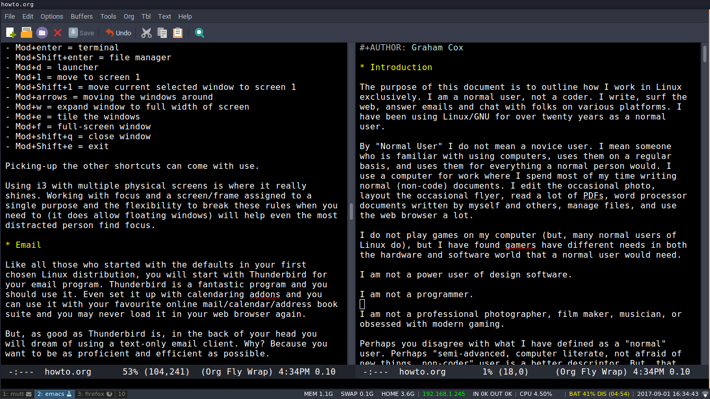
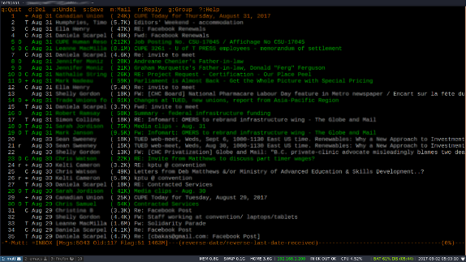
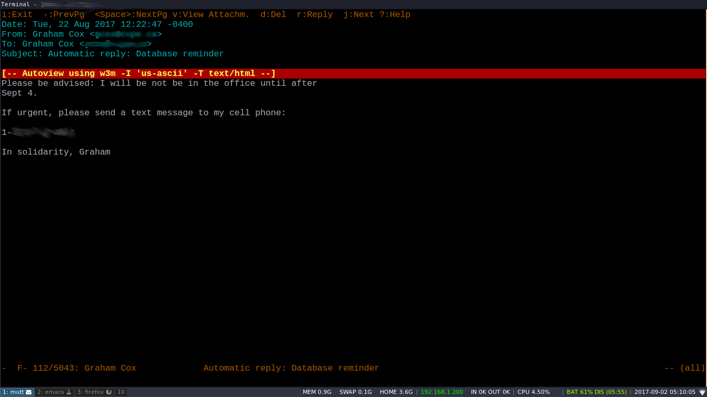

Introduction
============

The purpose of this document is to outline how I work in Linux. While there are lots of documents online about how coders set-up and tinker with Linux, there are not many for normal users who want to become more proficient in their computer use.

I think of myself as a normal user who uses Linux.

By "Normal User" I do not mean a novice user. I mean someone who is familiar with using computers, uses them on a regular basis, and uses them for everything a normal person would. I use a computer for work where I spend most of my time writing normal (non-code) documents. I edit the occasional photo, layout the occasional flyer, read a lot of PDFs, word processor documents, manage files, and use the web browser a lot.

I do not play games on my computers (though, many normal users of Linux do), and "gamers" often have different needs in both the hardware and software world that a normal user would need.

I am not a power user of design software.

I am not a programmer.

I am not a professional photographer, film maker, musician.

I use a computer to do what 99% of people on a computer do: writing, reading, web surfing, and watching the odd movie.

Perhaps you disagree with what I have defined as a "normal" user. Perhaps "semi-advanced, computer literate, not afraid of new things, non-coder" user is a better descriptor. However, I think what I have outlined here -- as I helped other set this up over the years -- is perfectly manageable for a normal heavy user of computers.

For some background, I started my Linux journey with the full-time use of a basic RedHat 6 install (in the late 1990s), eventually moving to [Fedora](https://getfedora.org/), and then settling on [Ubuntu](https://ubuntu.com).

I generally dislike a lot about Ubuntu (especially their foray into Amazon partnerships and Unity desktop environment where I even moved to Debian Unstable for a while), but it just works and I am now familiar with the Debian package managers and system. I also like my programs up-to-date and Ubuntu repositories achieve this. I am sure that it is the case with most other systems, but the Ubuntu community is large and the answers to questions are readily available with a quick web search. I dream of one day moving to Arch, but that day is far off as I am too busy with work these days to move everything over and getting it to work.

Ubuntu is the easiest Linux Distribution I have ever found to install on Thinkpads. And, I am very fond of Thinkpads as they are no nonsense laptops that last forever (and are generally resistant to spilling coffee on them). I have owned 7 over the previous two decades, usually multiple at the same time and some for longer than 7 years without replacing anything more than some RAM. Also, a refurbished Thinkpad is within most people's laptop budgets and even a rather old one will run Linux like a dream. Over the previous two decade, I have barely had to adjust a single configuration file to get everything to work.

(All the examples below for installing are for Ubuntu installed on a PC.)

I have also had good experiences with [GalliumOS](https://galliumos.org/) (especially on my $100 Acer Chromebook) -- with the same ease of install as Ubuntu on a Thinkpad, it Just Works. A cheap Chromebook is a rather great basic writing machine for travelling and cafe work if you can replace ChromeOS with a full Linux distribution. Even Crouton -- a Linux install that sits next to ChromeOS -- is not terrible.

Having an extremely cheap and fairly secure laptop running Linux means never having to wonder if you should take your main computer with you for worry you will lose or break it. And, it means if you find a nice spot to do some writing or work, you will have a keyboard and your Emacs available.

I have [written elsewhere](https://citizenspress.github.io) on why I use Linux and other Open Source and Free Software. You may have your own reasons, but if you have ever experienced the frustration of something not working the way you want or thinking that there has to be a better, cheaper, and more freeing way to use a computer then GNU/Linux is probably for you.

Linux Distribution
==================

You will start your Linux journey finding a Linux distribution.

A Linux Distro is a pre-packaged installation of the Linux kernel, some necessary [GNU software](https://en.wikipedia.org/wiki/GNU), fancy designed fonts and icons sets, the additional open source programs a regular user needs installed by default (web browser, word processor, email client, picture viewer, music player, etc.), an easy way to install additional software (remember, most of it is free) via centrally maintained software repositories, and a desktop environment that makes it easy to point and click your way around. Think of it like the full OSX package, where OSX is the "distribution" for Macs (though, it is the only one), only better.

Most of the time, people choose their first favourite Linux distribution based on the default desktop environment/window manager it provides. Some examples of more common desktop environments are [Unity](https://unity.ubuntu.com), [Gnome3](https://www.gnome.org/gnome-3/), [KDE (Plasma)](https://www.kde.org/announcements/plasma-5.8.0.php), and [Xfce](https://xfce.org/).

To start your search, simply download a couple of different distributions, use them from the Live CD/USB (allowing you to run, but not have to install the distribution) for an hour or two doing browsing and some writing, pick one and install it. You will find detailed, easy to follow instructions for installing your selected distribution on the websites, but most are driven by an easy to follow install wizard. On a new computer, it will likely only take you about 20 minutes to get a fully running Linux distribution like those linked below installed.

I would not spend too much time deciding which one to start with as you will either learn to love it, or you will move onto another distribution. And, at this point do not think too much about which distribution you will end up using. But, do make the choice to use one and stick with it for a little bit. As with anything, ease of use at the start might not correlate with functional use over the long run. The great thing about Linux is that you can easily shift from one to the other and still use the same programs and open your files no matter what distribution you are using.

You will likely start with a Dual Boot setup where when you boot your computer you still have the choice of booting into Windows. However, after a few weeks you will realize you really never have to go back into your MSWindows install. And, when you do, you will wonder why nothing works as well as it does in your chosen Linux distribution.

My suggestions of which distributions to start with would include (based on ease of use):

-   [Ubuntu](https://ubuntu.com) (Also see [this step-by-step tutorial for installing Ubuntu](https://tutorials.ubuntu.com/tutorial/tutorial-install-ubuntu-desktop#0))
-   [Linux Mint](https://linuxmint.com/) (Also see [Dumping Windows and installing Linux Mint, in just 10 minutes](http://www.zdnet.com/article/dumping-windows-and-installing-linux-mint-in-just-10-minutes/) for a step-by step guide)
-   [Fedora](https://getfedora.org/) (Also see [this set-by-step tutorial for Fedora install.](https://www.tecmint.com/fedora-21-workstation-installation/?utm_source%3Dfeedburner&utm_medium%3Dfeed&utm_campaign%3DFeed%253A%2Btecmint%2B%2528Tecmint%253A%2BLinux%2BHowto%2527s%2BGuide%2529)) Fedora is based on a different software package system to Ubuntu and Mint, so the commands outlined in this guide will have to be altered slightly. I believe you would replace "apt" in the commands listed below to "yum", but if that does not work the software store program works very well on Fedora.

The desktop environments of these three are rather different in look, but work in the same way Windows and OSX do. Most everything will seem at least a little familiar. Not so with the following window manager.

And, if you are a regular user of computers, you will find programs that mimic all of the programs you use on OSX and/or Windows. If you do not believe me, try a Live CD/USB for a few hours and see if you really need MSWord to write letters when [LibreOffice](https://www.libreoffice.org/) is works so well, is completely free, and come pre-installed with most Linux distributions. (Also, if you *really* need MSOffice, there is a way to [install that too](https://www.codeweavers.com).)

i3 Window Manager
-----------------

Once you have spent some time in your Linux distribution, you will get the urge to compare desktop environments and/or window managers. And, once your are done comparing default window managers in Gnome, Gnome3, KDE, Ubuntu's Unity, Xfce, etc. you will likely realize that what you really wanted is something a bit different and less flashy.

You may realize that what you really want is a window manager that just gets out of your way and does not bother you unless you have explicitly asked it to. You may also realize that your mouse -- while very useful -- could be reached for more sparingly. At this point you will realize that there is something called a tiling window manager and you will wonder why you have only heard about such a thing now after so much time messing about with these distracting graphical interfaces.

> *A tiling window manager does not stack windows on top of one another, hiding parts of windows from your view and wasting precious screen real estate with some "background". A tiling window manager puts windows side by side or vertically arranged, with all windows of programs you are using in full view.*

And maybe at the same time, after years arguing with Windows users that the mouse is slower than using shortcuts, you will realize you do not know the power of keyboard shortcuts until you switched to a [tiling window manager](https://en.wikipedia.org/wiki/Tiling_window_manager#Tiling_window_managers).

If you choose to use a tiling window manager, you will realize keyboard shortcuts are not about speed (though, they are faster for many things), they are about not having to reach for the mouse to do something as simple as bringing Firefox into focus to scroll down to the next section you are reading and then move back to your editor. You will realize it is not just slower to move your hand to the mouse and interrupt your thought process to switch windows that bothers you, but that it is not *automatic*.

When you type a word, you are not thinking of the letters, you are thinking of the words (or even ideas) and they just appear on the screen -- put there by your fingers which seem to act on their own.

Similarly, when you are moving about your desktop, switching windows, with a keyboard short cuts (in a tiling window manager) you are not thinking about it, you are just doing it. In fact, you really only get it when you go to look something up in Firefox and your fingers have already brought it into focus and have started typing the search term into the search box. Or, that you have a great idea while reading some page in a PDF and before you really think about it, your fingers have brought-up your *Emacs* text editor and you are just typing out your thought without thinking about how you got there.

Things become this automatic when working in a tiling window manager and using shortcuts. And, the feeling of real efficiency is glorious.

Unfortunately, you will not really appreciate this until you actually learn to use one. So, I will try another reason to get you to learn to use a tiling window manager:

Using a tiling window manager is about bringing **focus** back to your computer work.

If focus is something you are seeking (and who isn't, really?) you should use [i3 Window Manager](https://i3wm.org/).

There are others options and obviously you do not *have* to use i3wm, but you *should*. Other window managers are all -- to varying degrees -- quite good. However, window managers should get out of your way and facilitate working on your computer. They should not take up precious screen space (do you really need to see the Firefox launch icon all the time? Why, are you scared it might accidentally uninstall itself?) and they should make your work flow as smooth as possible.



One screen for Mutt, Emacs, Firefox, terminal, graphical file manager, and other. Use screen 10 (modifier key + 0) as your temporary distraction. If you have a wide and beautiful screen, you can even put your email mailboxes (all of them in *Mutt*) and text editor on the same screen and be amazed at the efficiency, speed, and automatic movement in completing tasks.

i3 window manager can be made to look nice enough to not be ugly with a decent i3blocks and i3bar configuration, and a pop-up menu program like rofi. ([You can find my configuration files here.](https://github.com/citizenspress/dotfiles) They are in the "dotfiles" folder.)

To install, open a terminal (usually Ctrl+Alt+t or search for "terminal" in the application launcher) and copy and paste the following in. This will install the necessary packages from the official Ubuntu repository. It will ask for your password.

``` bash
sudo apt install i3-wm i3blocks i3lock i3status rofi compton fonts-font-awesome
```

Then add my template configuration files to your main ("Home" in Linux) directory. Linux configures programs via plain text files that usually start with a "." and end in the letters "rc" or ".conf". The default view is that these files hidden since you do not touch them after everything is working smoothly. My configuration files have a few things in it including a Compton configuration file (for smooth graphics acceleration for things like video and smoother scrolling in Firefox). The Compton configuration is in my Github "dotfiles" folder too. Have a quick read through, do some web searches for the code if it does not work as advertised. It should be fairly clear as I have copied the code from others around the web with only slight variations.

Learning the i3 commands is easy enough if you use my config files:

-   Pick a modifier (the "Windows" key on a basic PC keyboard)
-   Mod+enter = terminal
-   Mod+Shift+enter = file manager
-   Mod+d = launcher
-   Mod+1 = move to screen 1
-   Mod+Shift+1 = move current selected window to screen 1
-   Mod+arrows = moving the windows around
-   Mod+w = expand window to full width of screen
-   Mod+e = tile the windows
-   Mod+f = full-screen window (press again to leave full screen mode)
-   Mod+shift+q = close window
-   Mod+Shift+e = exit i3

Picking-up the other shortcuts can come with use. And, if you do not like those, you can always change them in the .i3/config file. It is pretty easy to follow what is going on as it is written in readable plain text.

Using i3 with multiple physical screens is where it really shines. Working with focus and a screen/frame assigned to a single purpose and the flexibility to break these rules when you need to (it does allow floating windows) will help even the most distracted person find focus.

Email
=====

Like all those who started with the defaults in your first chosen Linux distribution, you will start with Thunderbird as your email program. Thunderbird is a fantastic program and you should use it. Even set it up with calendaring addons and you can use it with your favourite online mail/calendar/address book suite and you may never load email in your web browser again.

But, as good as Thunderbird is, in the back of your head you will dream of using a text-only email client. Why? Because you want to be as proficient and efficient as possible. And, you want to use your keyboard more instead of reaching for that mouse just to quickly respond to an email.

The email program of your dreams is [Mutt](https://en.wikipedia.org/wiki/Mutt_%2528email_client%2529).

Mutt is a text only, console (terminal) based email client. It looks like it is a throw-back to the days of library terminals in the 90s, but it is still under active development and it is modern software.

Mutt configuration
------------------

Email is simply writing and reading messages. So, no distractions with setting-up sidebars and other things. Separate windows for each account, simple views of emails, quick and plain text responses using Emacs. When something needs to be a fully formatted HTML email, I write in org-mode or Markdown and export it from within Mutt to HTML with a quick key stroke (see my configuration file for the alt-o and alt-m commands).

As with all of my chosen colour schemes, Mutt is set to black background, white/grey text and marked-up by yellow, red, green and orange highlights.

There is nothing very fancy in this set-up, but that keeps things running smoothly.

Since Mutt runs inside a terminal, you have to choose one to use. My current chosen terminal for Mutt is [Sakura](https://launchpad.net/sakura). Also in use: xterm, st (Suckless Terminal), Xfce's basic terminal, and Terminology. The main benefit of all of these is being able to extract a URL easily and having (at least in my experience) low latency.

My Mutt is set-up to use the following programs:

-   urlview (CTRL-b) to extract URLs from emails and open them with Firefox for linked websites that require something more than a plain text browser.
-   w3m (I find it works better than elinks) to easily deal with and view HTML emails within Mutt by default.
-   [Mail Utilities (mu)](https://code.google.com/archive/p/mu0/) (alt-f) for fast mail searches and email address look up from within Mutt with little configuration (included in my template .muttrc file). The set-up for mu takes a couple of lines of code, but is worth the extra 15 mins of work to get it running.

``` bash
sudo apt install mutt urlview w3m mailutils sakura isync elinks pandoc
```





Work and personal email accounts.
---------------------------------

Mutt does not fetch your mail (though, you can set it up to send your mail and you might as well). Instead, you need to use a program that syncs your mail in the background.

Syncing email through a background process is glorious for doing work. No annoying pop-ups and no interruptions, but all email is there whether you open the email client or not. Also, near zero resources of the computer are used. This means longer battery life and better concentration when trying to finish a project. Using i3wm also allows mutt to be open and give the discrete notification that there is some new mail in some inbox. When writing in full screen mode this is hidden, but when doing casual work in other screens, seeing the notification is not an interruption as all it does is highlight the mutt bar at the bottom left of the screen in a non-intrusive red.

Syncing of email occurs through either mbsync and/or Offlineimap. While both do the job well, mbsync does a better job of applying read flags through IMAP and crashes more gracefully (though, both crash less than once a month even on my laptop where syncing is interrupted by constant suspending).

-   Work email goes through [DavMail](http://davmail.sourceforge.net/) on my computer making syncing with MicroSoft less painful. See the DavMail website for full instructions on DavMail setup.

-   Personal email is a regular IMAP sync to any personal cloud account.

You can [download my template .mbsyncrc file here](https://github.com/citizenspress/dotfiles/blob/master/templates/.mbsyncrc). The file is commented and should be fairly easy to get you up and running. Just open it in your favourite text editor (which is Emacs) and edit the appropriate lines to include your email information.

A simple cron setup (a program that runs things at regular intervals in Linux) to run your email fetching program every 3 or 5 minutes is what you want. And the setup could not be easier.

In a terminal:

``` bash

crontab -e
```

And, add the following at the end of the file.

``` bash

*/5 * * * * /usr/bin/mbsync -qq -a > /dev/null 2>&1

```

Of course, using Mutt also increases the efficiency and speed of dealing with emails so getting back to real productive work is less of a distraction.

And using Emacs and Mutt means installing [post-mode](https://github.com/zedinosaur/post-mode) in Emacs to make it efficient. Emacs has its own package manager to install modes, but post-mode is not in there. So, you will have to follow the short instructions on the post-mode page.

Basically, it amounts to downloading post.el from the site. Create a directory called ".emacs.d" in your main "home" directory and move the "post.el" into the ".emacs.d" directory.

Then put the following in your "[.emacs](https://github.com/citizenspress/dotfiles/blob/master/templates/.emacs)" file (if you are not simply using my .emacs file)


    ;;POST MODE FOR MUTT
    (load "~/.emacs.d/post")
    (add-hook 'post-mode-hook 
      (lambda()
    (auto-fill-mode -1)
        (setq fill-column 72)    rfc 1855 for usenet messages
        ))
    (dolist (hook '(post-mode-hook))
          (add-hook hook (lambda () (flyspell-mode 1))))

Now, post-mode (and flyspell-mode, the spell checker) should load when you reply to an email.

Mutt files (and create the mail directory) (click for examples)

-   [.muttrc](https://github.com/citizenspress/dotfiles/blob/master/templates/.muttrc)
-   [.muttrc-personal](https://github.com/citizenspress/dotfiles/blob/master/templates/.muttrc-personal)
-   [.muttrc-work](https://github.com/citizenspress/dotfiles/blob/master/templates/.muttrc-work)
-   [.mailcap](https://github.com/citizenspress/dotfiles/blob/master/templates/.mailcap)
-   .Mail/

[Or follow the instructions on this page](https://thefullsnack.com/drafts/mutt-setup.html) for a full working basic Mutt configuration using mbsync. (Just replace **brew** with **sudo apt** and everything should work).

HTML Email
----------

Most complaints on the internet about using Mutt are around the near ubiquitous use of HTML email by the rest of the world. However, this has never been an issue with the current set-up:

-   W3M for automatically displaying HTML email as plain text.
-   Pressing "v" (to view attachments) in mutt, select the html part of the email, and press "m" (launching the mailcap or default web browser) launches the html in your browser for the full html experience.
-   Script to run Pandoc for converting Markdown or Org-mode to full HTML emails for sending fancy emails from within Mutt. (See my .muttrc-personal configuration.)
-   [iCal scripts for sanely](https://github.com/marvinthepa/mutt-ical) (not mine) viewing an importing calendar invites.

Most HTML emails are simply text with links, so converting them to plain text with the option of opening the email in Firefox if there are embedded images an the like makes email life simple.

Writing emails in a Markup language like Markdown or Org-mode makes writing more complex HTML that look great a breeze with the Pandoc script.

Emacs
=====

Emacs is an extremely advanced text editor. But, what is a text editor and why should you care?

Programmers/coders use text editors to write and edit their computer code. Plain text -- text without layers of formatting on top of it -- is the input language for computer coding. But, it is also what you write when writing a simple email, compose a text message on your phone, or write a PhD thesis. When you press keys on your keyboard you are writing in plain text.

Text editors, unlike word processors, are used to edit text in the most efficient way possible. They are designed by people who spend their work (and sometimes leisure) life editing text files and they also have the skills to alter/improve their text editor programs to operate perfectly. Some coders work together to make text editors for writing text and editing text easy and efficient and release them for free to the world. But, I feel the coding community have hidden these gems of programs designed for what most normal users do from us.

Instead, us normal users are introduced at school to clunky, expensive "Word Processors" like MS Word that need the newest hardware to run. Programs that supposedly make it easy to point and click your way around a text document, bold word, change fonts, apply headers, send to others to edit, and export to PDFs.

Unlike MS Word, Emacs is free. The code that runs it is available to all to customize and edit. It is "extensible", meaning it can continue to be built on and improved, using the editor itself, while you use it. It can be fully customized to how ever you want to use it. And, it can do all those things a Word Processor can do -- and much more -- and do it in style. The best part is that being a normal user, you can use all of these superb programs without customizing anything since getting the editor to do what you want is a simple web search away.

Emacs may have lost the [text editor wars](https://explainxkcd.com/wiki/index.php/1823:_Hottest_Editors) in the mid-1990s, but it is still the best text editor. And while I am not a fanatic about using Emacs, it is clear that if you use anything else as your text editor you are not only a fool, [but a heathen](https://en.m.wikipedia.org/wiki/Editor_war#Humor).

But, in all seriousness, learning to use Emacs (or really any other advanced text editor) will increase your efficiency and proficiency in writing and editing.

In addition, if you learn some [simple markup language](http://www.makeuseof.com/tag/markdown-4-reasons-learn-now/) like [Markdown](https://en.wikipedia.org/wiki/Markdown) or Org you will be well on your way to replacing MS Word for most of your writing needs even if they require some fancy formatting. Learning these "markup language" is super easy and the reality is you probably already know some Markdown. If you have ever put an "\*" on either side of a word to make bold in WhatsApp, you have coded using the Markdown markup language.

 to download the Org version of this document.](emacs.png)

To learn the basic editing features will not take that long and in the mean time, you can always use the drop-down menus if you get stuck. However, learning the shortcuts will make your writing and editing life simple and *fast*. Do not worry about the supposed "steep learning curve". Basic text editing is easy in Emacs, it can literally take you an afternoon to get used to it. And, once you do learn it, it will be there for you for a lifetime.

If that is too much, you can always click "Options" and turn on CUA keys which will mimic cut, paste and undo like what you are used to (CTRL-C to copy, etc.).

There are many excellent tutorials on how to use Emacs on line, so I will not bother to replicate them here. Here are just a few useful ones:

-   [Emacs tour](https://www.gnu.org/software/emacs/tour/)
-   [How to learn Emacs](http://sachachua.com/blog/2013/05/how-to-learn-emacs-a-hand-drawn-one-pager-for-beginners/) (Actually, everything Sacha outlines is worth going over. Especially Org-mode setups.)
-   [Emacs user guide](https://www.gnu.org/software/emacs/tour/index.html)
-   [University of California at Berkeley](https://www.decf.berkeley.edu/help/unix/emacs.html)
-   [IBM developers tutorial](https://www.ibm.com/developerworks/aix/tutorials/au-emacs1/index.html)

There is also a Learn Emacs module built into Emacs itself. Just start Emacs and hold Ctrl and press h, release both and then hit the letter "t". Emacs will basically teach you how to use it.

I will add that the most useful key command when I was learning Emacs was hitting and holding CTRL and hitting the letter "g". This will basically undo any command that you have accidentally entered and bring you back to the editor window.

To find a file, C-x C-f.

To save a file, C-x C-s.

To quit emacs, C-x C-c.

Pro tip  
Remember to remap your Capslock key as CTRL in your keyboard settings. When you use Emacs a lot, you hit the Ctrl key a lot. No one really uses Capslock, so remapping it to the Ctrl key means it becomes a useful key and is easier to reach than the regular Ctrl key on most keyboards. And, if you start with this remapping, you will not have to go through the process of relearning this later.

``` bash
sudo apt install emacs org-mode emacs-goodies-el post-el auctex
```

Emacs Configuration
-------------------

Like with most Linux programs, Emacs configuration lives in a plain text file. Emacs can have many versions, but the default is .emacs.

There are many .emacs files you can use, but [you can start with mine](https://github.com/citizenspress/dotfiles/blob/master/templates/.emacs) in my [github templates dotfiles folder](https://github.com/citizenspress). You can open the .emacs file in Emacs and have a read through. Do not get too worried about what the code says, but the comments (lines starting with ";") will tell you what the parts do.

Org-mode is one of the reasons so many people go through the process of learning Emacs in the first place. It is an extremely powerful organizational tool with some added benefits for normal users too.

Best thing to do is live in Org-Mode and keep flyspell-mode (the spell checker) and word wrap always on.

There are several things defaults that make org-mode work for my purposes.

-   Factsheet template for LaTeX export to PDFs.
-   HTML export template.
-   For everything else use pandoc.

Other things that are extremely useful in Emacs for people who just love to write and be efficient users:

-   [Writeroom-mode](https://github.com/joostkremers/writeroom-mode) is a beautiful thing.
-   M-x unfill-region and M-x unfill-paragraph are extremely useful when editing something someone else sent you that has weird line breaks. This is included in my .emacs template file linked above.
-   M-c (capitalize the first letter of the next word); M-l (make the next word all lower-case) make correcting strange capitalization errors easier. M-u is also useful (capitalize the entire next word) especially if you have remapped the Capslock key.
-   [Learn to use macros](https://www.emacswiki.org/emacs/KeyboardMacros). They are fun and unbelievably useful.
-   Use post-mode for email writing in Mutt.

LaTeX
=====

Ever written or plan on writing something that will be over tens of pages long? Like a academic thesis, paper, book, briefing note, fact sheet, backgrounder, etc.? Ever been annoyed with your word processor and wonder how a plain text file with some formatting can take so long to load and be limited to only the newest computers with some resource heavy word processor to edit. Then you should take a look at learning LaTeX.

[LaTeX](https://simple.wikipedia.org/wiki/LaTeX) is a high-quality typesetting system (layout engine) for documents. And, it makes writing your Masters and/or PhD thesis much easier when compared to Word. LaTeX is not really a "Linux only" sort of program. It installs on most operating systems, but I think it is easiest to install and use on Linux.

Learn LaTeX, build a configuration that works for the type of documents you want to use LaTeX to produce. But, do not write pure LaTeX code. At this point you should be using Emacs, Org-mode, and a tiling window manager. Your entire work flow is about distraction free simplicity and efficiency. So, why are you bothering typing all that LaTeX code out? There is a better way.

Writing documents in Org or Markdown means you can create basic LaTeX exports with a couple of short key strokes. Org-export exports directly to LaTeX (it will even run it to produce a PDF). [Pandoc](https://en.wikipedia.org/wiki/Pandoc) will produce a basic LaTeX document from basic Markdown. And, depending on the circumstance, import it into the template you have found that fits your needs. (You can also use XeLaTeX if you really like nice fonts -- and who doesn't? -- in your documents.)

LaTeX is best used with templates. Make a folder of templates. Load some preamble into your Org files that you seek to export from your templates folder.

-   Factsheet
-   Report
-   CV
-   Long report
-   Thesis

When you do want to edit something in LaTeX, do it in Emacs with Auctex-mode, it will save you time and your sanity.

``` bash
sudo apt install texlive-full

```

From inside Emacs using Auctex-mode, building your PDF document is as easy as C-c C-c (or clicking build from the drop-down menu or hitting the PDF symbol in the toolbar).

If you ever want a full featured Word Processor that uses LaTeX, have a look at [LyX](http://lyx.org). It is free, cross platform, super easy to use, comes with a whole host of regular word processors features, and produces extremely nice looking documents.
